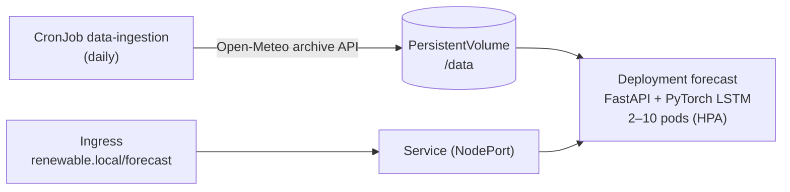
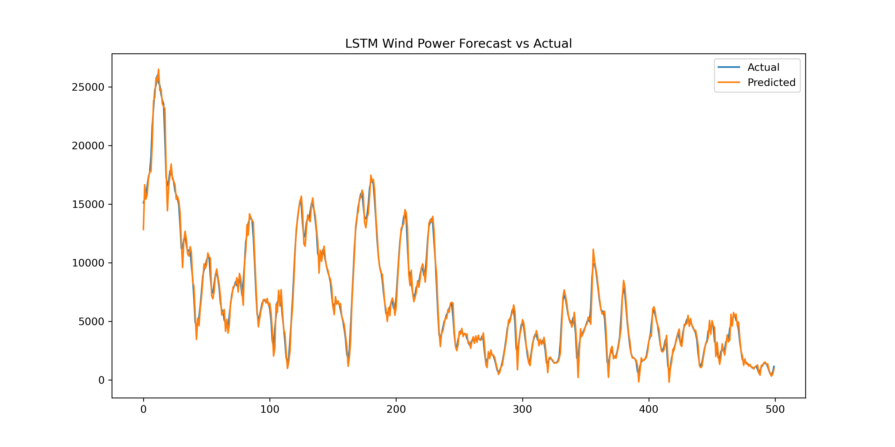

# Wind Forecast Service on Kubernetes

A hands-on Kubernetes project (January 2026): an LSTM wind-speed forecaster, served as a FastAPI
microservice and fed by a scheduled data-ingestion job, deployed on Minikube. It was built in phases,
from plain containers to a self-healing, autoscaled deployment with persistent storage and an ingress.



## Components

**Data ingestion** (`containers/data_ingestion/`): downloads the last 30 days of daily weather for Berlin
(max/min temperature, max wind speed) from the [Open-Meteo](https://open-meteo.com/) archive API and
writes `weather_YYYYMMDD.csv` to the shared volume. Location and period come from a ConfigMap. The same
image runs as a Pod, a Deployment or a daily CronJob.

**Forecast service** (`containers/forecast_service/`): FastAPI app that loads a PyTorch LSTM checkpoint
(`lstm_weather.pt`: 3 input features, with the fitted MinMax scalers and sequence length) at startup and
forecasts max wind speed recursively from the newest CSV on the volume.

| Endpoint | Purpose |
|---|---|
| `GET /health` | liveness probe |
| `GET /ready` | readiness probe (503 until the model is loaded) |
| `GET /predict?hours=N[&csv_path=...]` | N recursive forecast steps. The input data is daily, so one step is one day. |

## Kubernetes features used

| Phase | Objects | Files |
|---|---|---|
| 1 – Containers | Dockerfiles, environment-based configuration | `*/Dockerfile` |
| 2 – Workloads and config | Pod, Deployment, ConfigMap, Secret | `data-ingestion-pod.yaml`, `*-deployment.yaml`, `ingestion-config.yaml` |
| 3 – Operations | Rolling updates (`maxUnavailable: 0`), liveness/readiness probes, CPU/memory requests and limits, HorizontalPodAutoscaler (2–10 replicas at 70% CPU), PersistentVolume/Claim, CronJob, NodePort Service, Ingress, load generator (`hey`) and debug pod | `forecast-*.yaml`, `pv.yaml`, `data-ingestion-cronjob.yaml`, `ingress.yaml`, `load-generator.yaml`, `debug-pod.yaml` |

## Run on Minikube

```bash
minikube start --driver=docker
minikube addons enable metrics-server        # needed by the HPA

docker build -t data-ingestion:latest containers/data_ingestion
docker build -t forecast-service:latest containers/forecast_service
minikube image load data-ingestion:latest
minikube image load forecast-service:latest

kubectl create secret generic ingestion-secret
kubectl apply -f containers/pv.yaml
kubectl apply -f containers/data_ingestion/ingestion-config.yaml
kubectl apply -f containers/data_ingestion/data-ingestion-cronjob.yaml
kubectl apply -f containers/forecast_service/forecast-deployment.yaml \
              -f containers/forecast_service/forecast-service.yaml \
              -f containers/forecast_service/forecast-hpa.yaml

# fetch data once instead of waiting for the schedule
kubectl create job --from=cronjob/data-ingestion manual-ingestion

kubectl port-forward svc/forecast-service 8000:80
curl "http://localhost:8000/predict?hours=7"
```

`comands.sh` collects the commands used during development, including the ingress setup
(`minikube addons enable ingress`, then add `renewable.local` to your hosts file).

## Model exploration

`data/` contains the first modelling experiment: a univariate LSTM (168-hour look-back) on hourly German
onshore wind generation from the [Open Power System Data](https://data.open-power-system-data.org/time_series/)
time series. The input file `time_series_60min_singleindex.csv` is not included; download it from OPSD.



*Next-hour (one-step-ahead) predictions on the chronological test split. The multi-step forecasts
served by the API are a harder task.*
